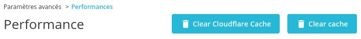
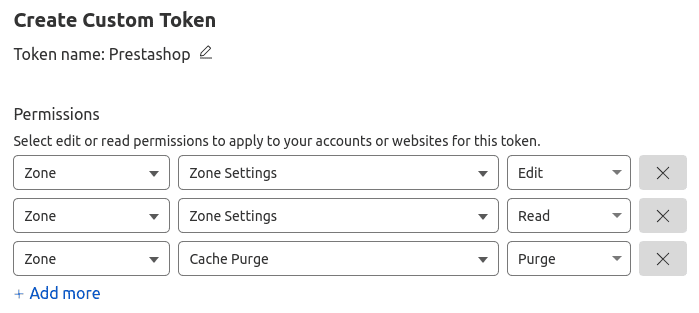

# Prestashop Cloudflare

## Presentation

Cloudflare API features in Prestashop:

- Clear Cloudflare Cache in the Prestashop admin

## Requirements

- Prestashop >= 1.7.6.0
- PHP >= 7.2.0

## Installation

Download the **pixel_cloudflare.zip** file from the [last release](https://github.com/Pixel-Open/prestashop-cloudflare/releases/latest) assets.

### Admin

Go to the admin module catalog section and click **Upload a module**. Select the downloaded zip file.

### Manually

Move the downloaded file in the Prestashop **modules** directory and unzip the archive. Go to the admin module catalog section and search for "Cloudflare".

## Configuration

From the module manager, find the module and click on configure.

| Field                | Description                                                                            | Required |
|:---------------------|:---------------------------------------------------------------------------------------|----------|
| Zone ID              | The website Zone ID                                                                    | Y        |
| Authentication mode  | The authentication mode: API Token or Global API key                                   | Y        |
| API Token *          | A valid token from your Cloudflare Account with permission on "Cache Purge" for "Zone" | Y        |
| Global API Key       | The Cloudflare Global API key                                                          | Y        |
| Account Email        | Email address associated with your Cloudflare account                                  | Y        |

\* For an API Token authentication (more secure), create a new custom API token with permissions on:

- Zone - Cache Purge - Purge
- Zone - Zone Settings - Edit
- Zone - Zone Settings - Read

## Clear the cache

In admin, go to *Advanced settings > Performance*

- Clear only Cloudflare cache with the button: **Clear Cloudflare Cache**
- Clear prestashop and Cloudflare cache with the button: **Clear cache**